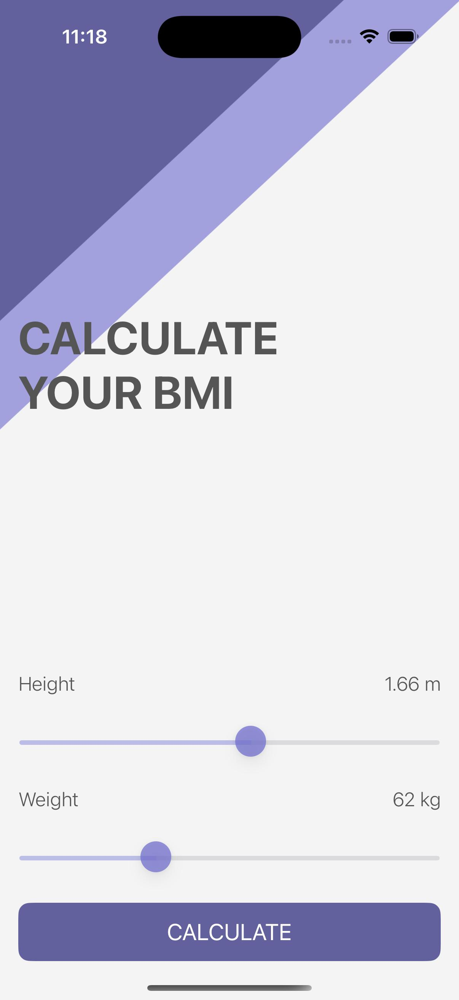
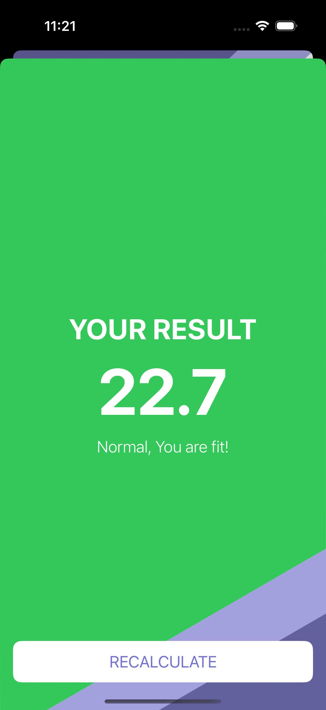
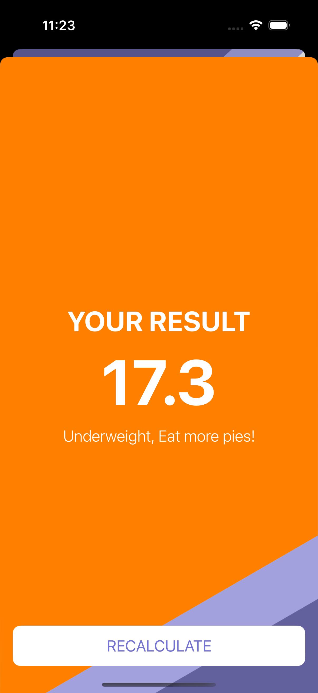
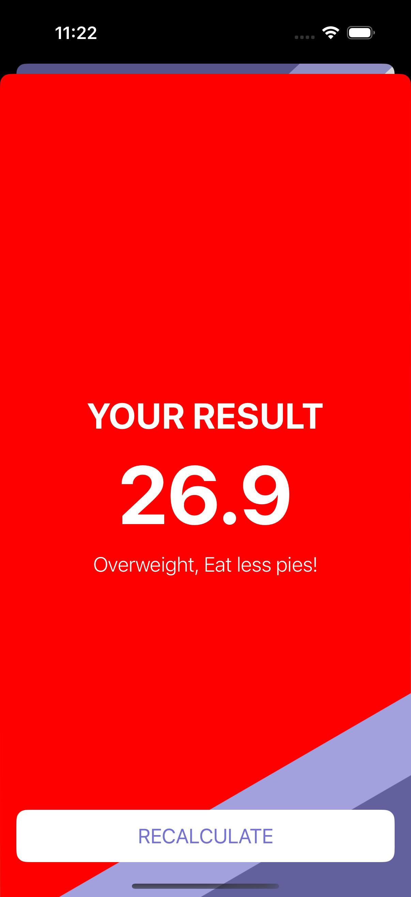

# BMI Calculator

A simple yet intuitive Body Mass Index (BMI) Calculator built in Swift. This app calculates BMI based on the user's input and provides helpful insights about their health status. The app features a clean user interface with two main screens.

---

## Screenshots

<p align="center">     </p>

*Note: Screenshots are located in the `screenshots/bmi_calculator` folder in the root directory.*

---

## Features

- **Two-Screen Interface**:
  - **Input Screen**: Users can enter their weight and height.
  - **Result Screen**: Displays the calculated BMI and health status.
- **User-Friendly UI**: Clean design for easy navigation and readability.
- **Swift-Based**: Written entirely in Swift, leveraging UIKit for a smooth experience.

---

## How It Works

1. **Input Details**: Users enter their weight (in kilograms) and height (in meters or centimeters).
2. **Calculate BMI**: The app calculates BMI using the formula:
   <p align="center">
    BMI = weight (kg) / [height (m)]<sup>2</sup>
    </p>
3. **Display Result**: The calculated BMI is displayed along with a message indicating the user's health status:
   - Underweight
   - Normal weight
   - Overweight
   - Obese

---

## Requirements

- **Xcode**: Version 12.0 or later.
- **iOS**: Compatible with iOS 13.0 and later.
- **Swift**: Version 5.0 or later.

---

## Setup and Installation

1. Clone the repository:
   ```bash
   git clone https://github.com/0xsonu/IOS-Apps.git
   ```

2. Navigate to the BMI Calculator project folder in Xcode.

3. Build and run the app on an iOS simulator or a physical device.

---

## Usage

1. Open the app and enter your weight and height in the specified fields.
2. Tap the "Calculate" button to view your BMI.
3. The result screen will display your BMI along with a message about your health status.

---

## Future Enhancements

- **Support for Imperial Units**: Allow users to input weight in pounds and height in inches.
- **Detailed Health Tips**: Provide more information on how to maintain or achieve a healthy BMI.
- **Dark Mode Support**: Enhance UI to be compatible with iOS dark mode.

---

## Contributing

Contributions are welcome! Feel free to open an issue or submit a pull request for any improvements or suggestions.

---

## License

This project is licensed under the MIT License. See the [LICENSE](../LICENSE) file for details.

---

